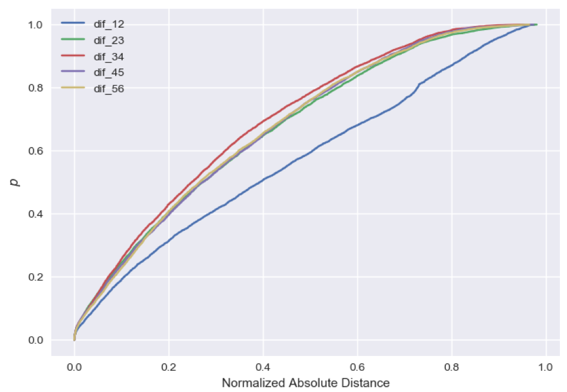
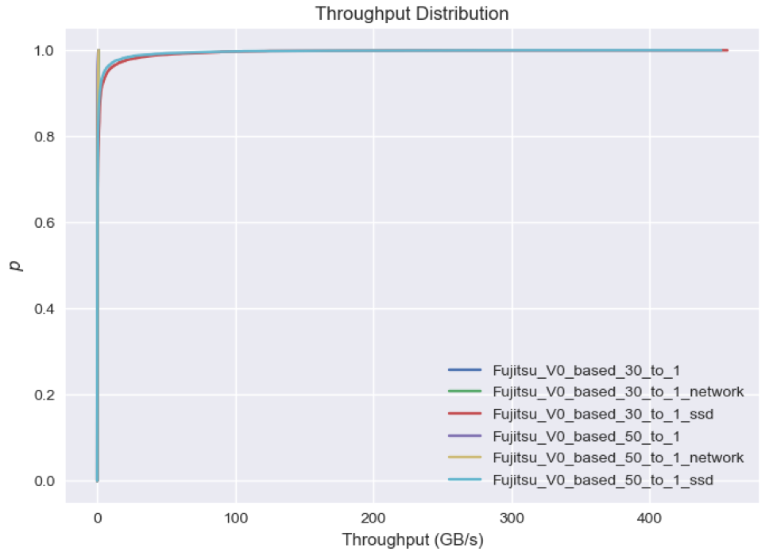
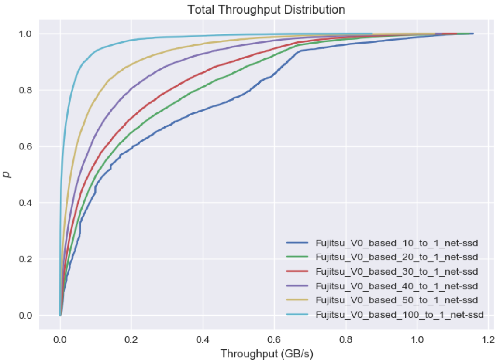
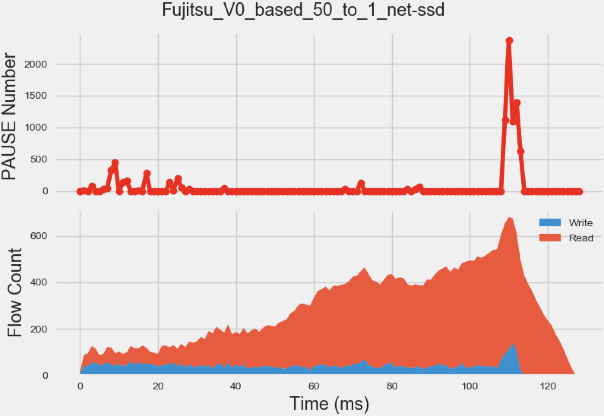
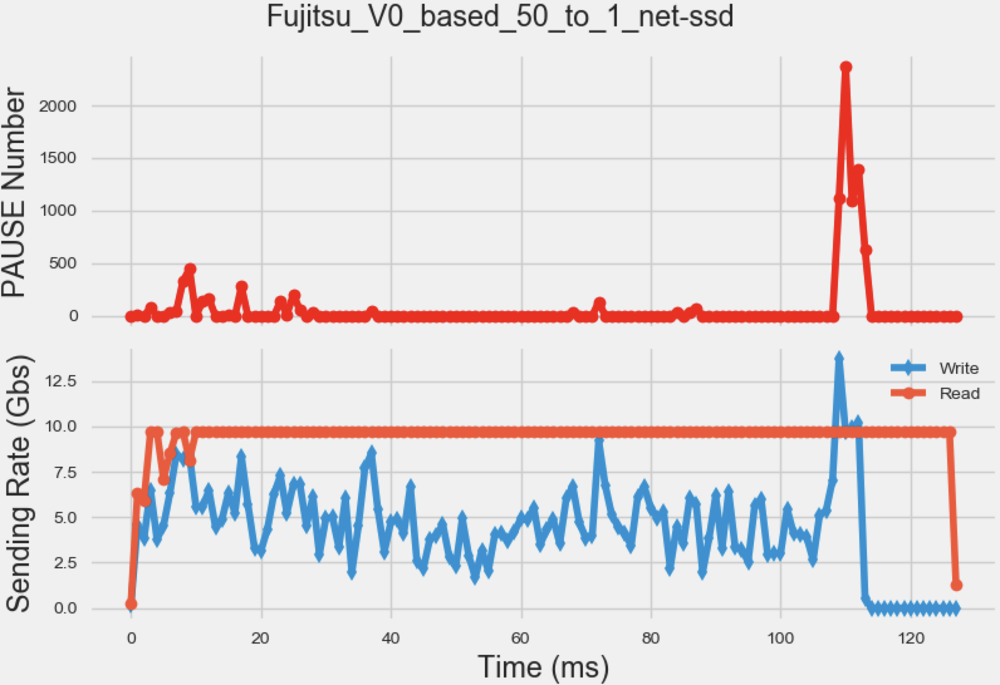

**Note: This project is under active development. 
The description listed here may be out of date due to the lack of maintenance. Please refer to the comment in the codes for the up-to-date information.**

This directory contains the scripts and trace files for the iterative network-ssd converge experiment. All the scripts below support `-help` argument to provide the detailed usage.

### Experiment Running

Run the snippet below on a Windows machine to start the converge experiment.
If '-conv Con_C' is included, SNIS stops if the convergency criteria is less than Con_C. Otherwise, SNIS will finish all iterations ,specified by '-num ITERATION_NUMBER'.

```
python windows_converge_test.py -workload WORKLOAD -conv Con_C -num ITERATION_NUMBER -[no]qcn 
```

```
python -i .\windows_converge_test.py --workload WORKLOAD --conv Con_C start_itr 1 --num ITERATION_NUMBER --[no]qcn 
```

*PS: To enable QCN mode, you also need to enable QCN flag in the network_simulation/config.txt.*


The intermediate log files will be stored under `test/WORKLOAD_NAME/ITERATION_NUMBER/` directory. 
Each directory will contain:
1. **net-ssd.csv**: the input SSD workload.
1. **result.csv**: the result SSD file with the network delay added to the write request.
1. **flow.txt**: the converted network workload.
1. **flow_map.csv**: the mapping between flow ID and flow destination port (the destination port of each flow is unique).
1. **flow_monitor.xml**: the summary file generated by FlowMonitor.
1. **queue.txt**: switch queue length in the run time.
1. **mix.tr**: the arrival time of packets on switch ingress ports.
1. **fct.csv**: each flow's port and completion time.

### Result Analysis

#### Converge Check

To check if the experiment result is converged, use the command below to get the CDF of the relative distance between the write requests in each iteration.

```
python converge_test.py -path DATA_DIR_PATH -write ITERATION_NUM
```

The CDF plot will look like below:

<!--  -->


#### Create Summary

```
python create_summary.py -path DATA_DIR_PATH
```

The snippet above will create the summary files `ITERATION_NUM.csv` files under the directory `DATA_DIR`.
Each summary file will contain fields 

>RequestID,InitiatorID,TargetID,ArrivalTime,VolumeID,Offset,Size,IOType,DelayTime,FinishTime,Flow_ID,Port,FCT,TotalDelay

Among them, the values that we concern the most are listed below:

1. DelayTime: The storage delay time.
2. FCT: Network delay time (flow completion time).
3. TotalDelay: The sum of above two delays, which means the total delay of each request.
4. IOType: 0 for read requests and 1 for write requests. Sometime we only care about one specific type.
5. Size: The data size of that request, in byte.
6. ArrivalTime / FinishTime: In network simulation, the start time of the read request is the ArrivalTime while the write request takes the FinishTime as its network transportation start time.


#### Performance Analysis

The script `draw_overall.py` contains most of the codes drawing experiment result plots.
Each plot is encapsulated in one function.
To get the plot, you need to un-comment the corresponding function in the main function.

The `-trace` argument in `draw_overall.py` accepts a list of pathes separated by comma.
Run command 

```
python draw_overall.py -trace PATH_TO_TRACE_1_DIR,PATH_TO_TRACE_2_DIR,...,PATH_TO_DATA_N_DIR
```

with function `drawTotalStats()` un-commented, you will get

<!--- -->


with function `drawOverallCmp()` un-commented, you will get

<!---  -->


The `-path` argument in `draw_overall.py` accepts a path to the experiment data directory.
Run command 

```
python draw_overall.py -path PATH_TO_DATA_DIR
```

with function `drawPAUSEAndFlow()` un-commented, you will get

<!---  -->


with function `drawPAUSEAndSendingRate()` un-commented, you will get

<!---  -->


<!---
1. This script needs to run under any folder containing following files: MQSim, ssdconfig.test.xml, workload-trace.xml
2. paras of ssd_simulator class:
	1) trace_path: the path of ssd simulation input, which is a tmp file
	2) output_folder: the workspace of ssd simulation
	3) output_name: the input of network simulation
3. paras of ssd_simulator.initialize_SSD_trace function:
	1) initial_path: the absolute path of ssd simulation, which is a path to an actual file with following format:
	   ["ArrivalTime", "VolumeID", "Offset", "Size", "IOType"]
4. paras of ssd_simulator.ssd_simulation_iter:
	1) arrival_time: the initial arrival_time of all requests 

5. workflow:
	1)call ssd_simulator.initialize_SSD_trace() to run the very first ssd simulation
	2) run network simulation with ssd_simulator.output_name as input
	3) run ssd_simulator.ssd_simulation_iter
	4) repeat 2) and 3)
        -->
